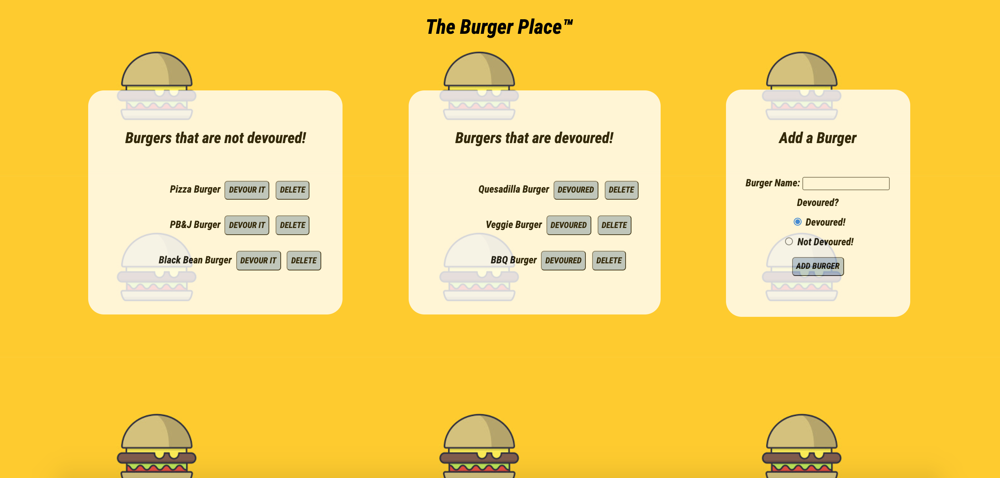

# The Burger Place

## Languages

## Description

The Burger Place is an application created using MySQL, Node, Express, Handlebars and an ORM. The MVC design pattern is utilized. Node and MySQL query and route the data in the application while Handlebars generates the HTML.

## Features

- This application features a form users can input their choice of burger by clicking "ADD BURGER". The user can then click to "DEVOUR IT" or "DEVOURED" to place a burger in the appropriate box. The user can click "DELETE" to delete a specific burger.

- When the user hovers the mouse over "ADD BURGER", the button will change to blue telling the user a neutral action is about to take place.

- When the user hovers the mouse over "DEVOUR IT" or "DEVOURED", the button will change to green telling the user a positive action is about to take place.

- When the user hovers the mouse over "DELETE", the button will change to red telling the user a negative action is about to take place.

## Deployment & Repository

- Heroku: https://the-burger-place-1.herokuapp.com/
- GitHub: https://github.com/bridgetrshannon/Burgers
